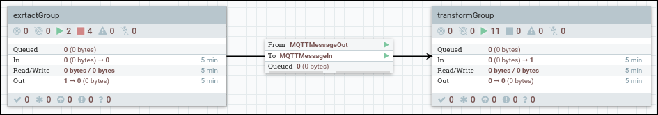
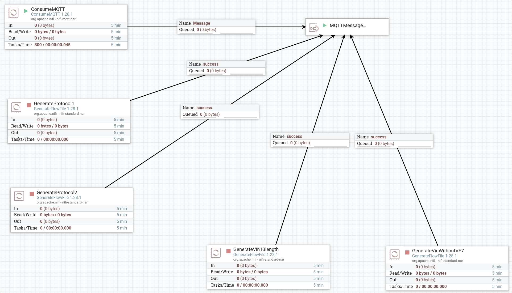
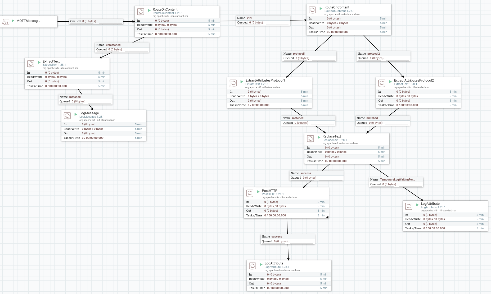

# ETL NIFI 
## URLs de connection utilises
- IHM emqx : `localhost:18083`
- IHM NiFi : `localhost:8181`
- URL utilisée par le simulateur de trames pour envoyer ses messages vers ActiveMQ : `tcp://localhost:8184`
- URL utilisée par NiFi pour consommer les messsages MQTT d'EMQX : `localhost:1883`

## Traitement des messages MQTT
Le traitement est divise en 2 parties.

### 1. extractGroup
Ce premier groupe contient un simulateur de trames MQTT simple afin de tester le systeme sans lancer le simulateur `vehicle_data_producer`. Il contient egalement deux generateurs de trames corompues ainsi qu'un processeur `ConsumeMQTT` qui se connecte au simulateur.

### 2. transformGroup
Ce second groupe s'occupe de lire les trames, d'en extraire les informations importantes (nombre de passagers, VIN, timestamp) et de les envoyer au serveur springboot ainsi que de les log.

## Securite du systeme et bonnes pratiques

Les communications entre les services devraient etre securisees via MQTT over TLS (mqtts:// au lieu de mqtt://) et HTTPS pour éviter l’interception de donnees. Il est aussi recommande de configurer une authentification sur le broker EMQX et de limiter les acces reseau entre les conteneurs. Enfin, logger les trames corrompues permet une surveillance constante et une réponse rapide en cas de problemes.

## Validation du bon filtrage des trames corrompues

Comme dit plus haut, nous avons deux processeurs dans `extractGroup` qui permettent de generer des trames corrompues :
- `GenerateVin13Length` qui genere des trames avec des VIN de longueur incorrecte
- `GenerateVinWithoutVF7` qui genere des trames avec des VIN sans le "VF7" initial requis.

Nous observons lors de l'execution du programme qu'aucune trame mauvaise n'est envoyee au serveur springboot, le filtrage des trames fonctionne donc correctement.

