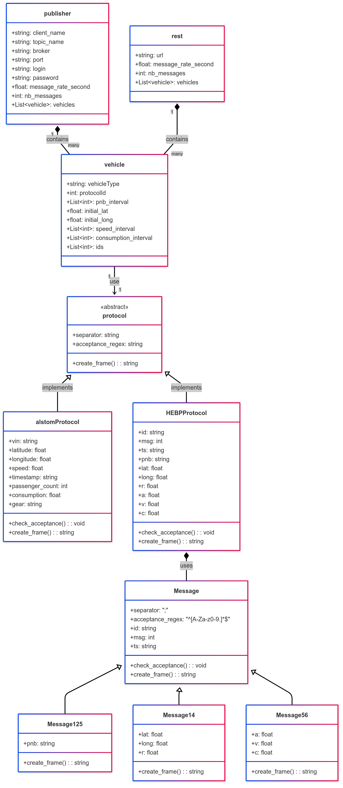

# Vehicule Data Producer

## Description

**Vehicule Data Producer** is a modular simulation and message-publishing framework designed to model vehicle data flows using multiple protocols and message formats. It supports publishing vehicle-related data to a broker (like MQTT), generating protocol-compliant messages, and simulating data transmission at defined rates.

This system is ideal for simulating connected vehicle environments or testing real-time communication systems in IoT and transportation.

### Features

- Multiple message formats (e.g., `Message125`, `Message14`, `Message56`)
- Protocol abstraction with multiple implementations (`AlstomProtocol`, `HEBPPProtocol`, `SiemensProtocol`)
- Flexible vehicle simulation (position, speed, consumption)
- Support for publishing to external brokers or REST endpoints
- Configurable intervals and rates for message generation

## Visuals

Here is the class diagram representing the architecture of the project:



## Installation

> Ensure Python is installed (3.8+ recommended). You may also need `paho-mqtt`.

```bash
# Install dependencies
pip install -r requirements.txt
```

## Usage

```bash
python3 main.py [vehicles_data.json]
```

If [vehicles_data] is given -> the task is ran in background
Else -> The IHM is shown and then you can directly edit a config file and then save it. 

### Protocols

The system supports three protocols:
- `AlstomProtocol`
- `HEBPPProtocol`
- `SiemensProtocol`

Each implements `check_acceptance()` and `create_frame()`.

### Messages management

Each message type inherits from `Message` and implements its own `create_frame()` method:
```python
message = Message125(pnb="PNB-001")
frame = message.create_frame()
```
Each datas from one vehicule will be sent nb_messages times (with one message type). Therefore, if you have multiple message (nb_msg_types) types,
nb_message_types * 100 * len(ids) messages will be sent. It's to be sure that the message is sent because we are in QoS 0 (no retry if fail to send).

## Roadmap

- [ ] Add support for additional message types
- [ ] Real-time dashboard for message tracking
- [ ] Implement REST feature message
- [ ] Link to master app

## Contributing

Contributions are welcome! Please:

1. Fork the repository
2. Create a new branch (`git checkout -b feature-name`)
3. Commit your changes (`git commit -am 'Add new feature'`)
4. Push to the branch (`git push origin feature-name`)
5. Open a pull request

## Support

Open an issue or reach out to antoine.jouy@epita.fr or theo.oliver@epita.fr.

## Authors and Acknowledgment

Developed by Antoine Jouy & Théo Oliver and contributors. Inspired by industrial protocols in mobility and transportation systems.

## License

This project is licensed under the EPITA FAKE LICENSE

## Project Status

🚧 Currently under active development. Feedback and contributions are highly encouraged.
